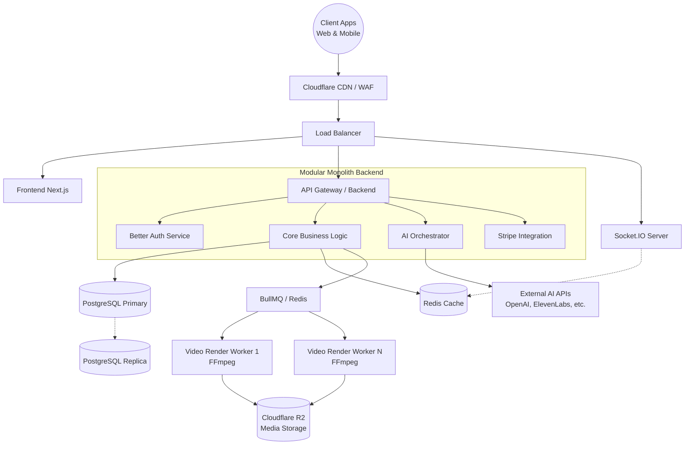
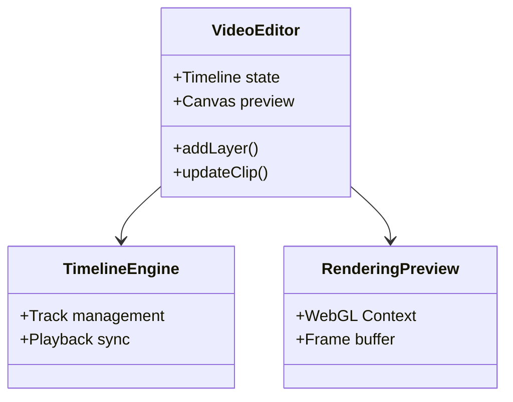
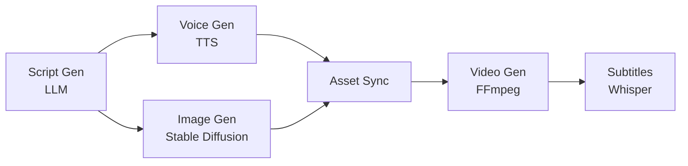
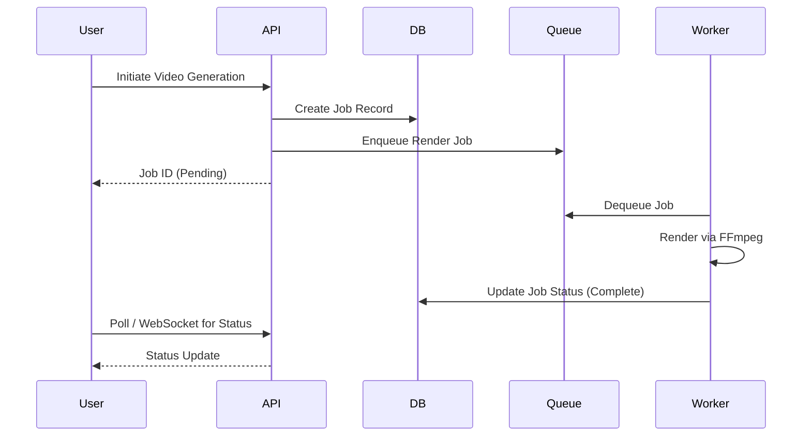
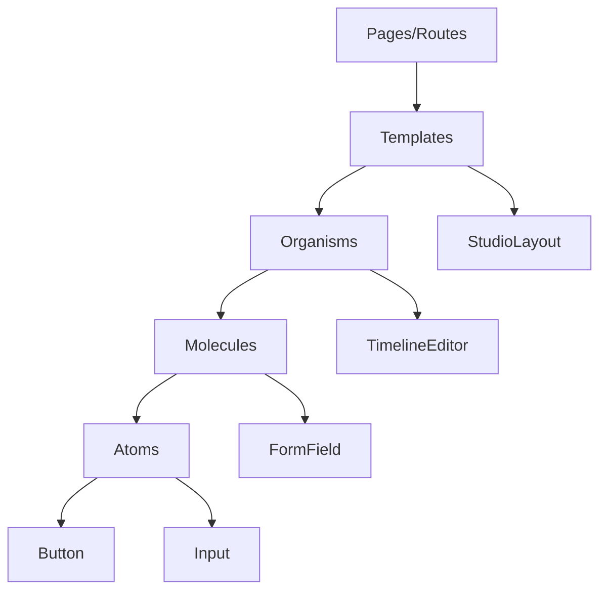

# Software Architecture Document: Tasma

Tasma is an AI-powered SaaS platform for creating short-form video content (YouTube Shorts, TikTok, Instagram Reels, Facebook Reels, and Ranking Videos). This document details the software architecture required to scale to 1M+ active users.

## 1. High-Level Architecture

The system utilizes a Modular Monolith backend with a scalable Next.js frontend, asynchronous video processing workers, and real-time WebSocket communication.



## 2. Low-Level Architecture

### Video Editor Module


### AI Pipeline


## 3. Microservice vs Modular Monolith Comparison

| Aspect | Microservices | Modular Monolith (Chosen) |
|---|---|---|
| **Development Speed** | Slower initially due to infrastructure overhead. | Fast. Single repo, simplified local development. |
| **Deployment Complexity** | High. Multiple pipelines, orchestration (K8s). | Low. Single unified pipeline. |
| **Team Size** | High. Needs dedicated DevOps and multiple teams. | Low-Medium. Ideal for startup/growth phase. |
| **Scaling Strategy** | Independent scaling per service. | Scale the entire monolith horizontally. |
| **Data Consistency** | Eventual consistency, distributed transactions. | ACID transactions within PostgreSQL. |
| **Debugging** | Complex (distributed tracing required). | Straightforward (single process stack trace). |
| **Cost** | Higher (infrastructure overhead). | Lower (efficient resource usage). |

## 4. Final Architecture Decision

**Decision:** Modular Monolith.
**Justification:** For a rapidly growing platform like Tasma, a Modular Monolith provides the perfect balance between development velocity and scalability. We can scale horizontally up to 1M+ users by adding more monolith instances and scaling the database vertically/with read replicas.
**Migration Path:** As specific modules (e.g., Video Rendering, AI Orchestration) require distinct scaling profiles, their clear module boundaries will allow them to be extracted into dedicated microservices later.

## 5. Data Flow Architecture

### Video Creation Pipeline


## 6. Infrastructure Architecture

```mermaid
flowchart TD
    Internet((Internet)) --> CF[Cloudflare CDN & WAF]
    CF --> Coolify[Coolify Hosting Cluster]
    
    subgraph Application Tier
        Next[Next.js Containers]
        Node[Node.js Express Containers]
        WSS[WebSocket Containers]
    end
    
    subgraph Data Tier
        PG_P[(PostgreSQL Primary)]
        PG_R[(PostgreSQL Replicas)]
        Redis[(Redis Cluster)]
    end
    
    subgraph Worker Tier
        Workers[FFmpeg Render Workers]
    end
    
    Coolify --> Application Tier
    Application Tier --> Data Tier
    Application Tier --> Worker Tier
    Worker Tier --> Storage[(Cloudflare R2)]
```

## 7. Security Architecture
- **Auth:** Better Auth implementing secure HTTP-only cookies and JWTs.
- **RBAC:** Roles (Admin, Pro User, Free User) managed via Prisma.
- **API Security:** Helmet, CORS, and Express-Rate-Limit.
- **Data Protection:** TLS 1.3 in transit, AES-256 at rest (handled by R2/Cloudflare).
- **Validation:** Zod schemas for strict request validation.

## 8. Scalability Strategy
- **Web Tier:** Stateless Node.js instances behind a load balancer.
- **Database:** Connection pooling (PgBouncer), read replicas for heavy read operations.
- **Caching:** Redis for session data, rate limiting, and frequent DB queries.
- **Workers:** BullMQ allows independent scaling of heavy video rendering nodes based on queue depth.

## 9. AI Services Architecture
The AI Orchestrator manages external dependencies:
- **LLM:** OpenAI GPT-4o for scripts. Fallback to Claude.
- **TTS:** ElevenLabs for voice. Fallback to Azure TTS.
- **Images:** Stable Diffusion / Midjourney APIs.
- **Resilience:** BullMQ handles retries with exponential backoff for AI API rate limits. Cost tracking is logged per generation to enforce subscription limits.

## 10. Video Processing Pipeline
The most resource-intensive segment.
1. API creates a standard JSON representation of the timeline.
2. BullMQ distributes the JSON to a Render Worker.
3. Worker downloads assets from R2.
4. Worker uses FFmpeg/Sharp to compose frames and audio tracks.
5. Progress is reported via Redis pub/sub back to the WebSocket server.
6. Final MP4 is uploaded to R2, and temporary files are purged.

## 11. Real-Time Architecture
Socket.IO handles real-time needs:
- Presence (who is editing a shared project).
- Progress bars for rendering jobs.
- Immediate notification of finished exports.

## 12. API Architecture
- **Style:** RESTful with standard HTTP methods.
- **Versioning:** URL-based (e.g., `/api/v1/projects`).
- **Docs:** OpenAPI/Swagger generated from Zod schemas.
- **Responses:** Standardized envelope: `{ data: {...}, error: null, meta: {...} }`.

## 13. Component Architecture (Frontend)

Atomic Design principles applied in Next.js:


