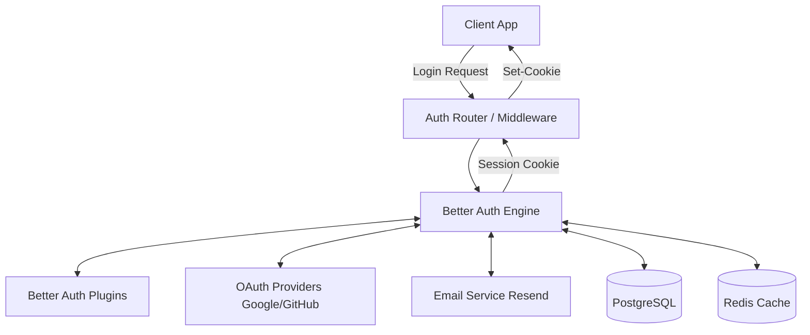
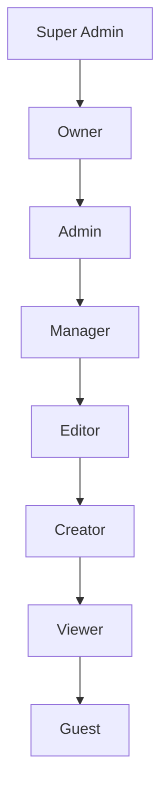
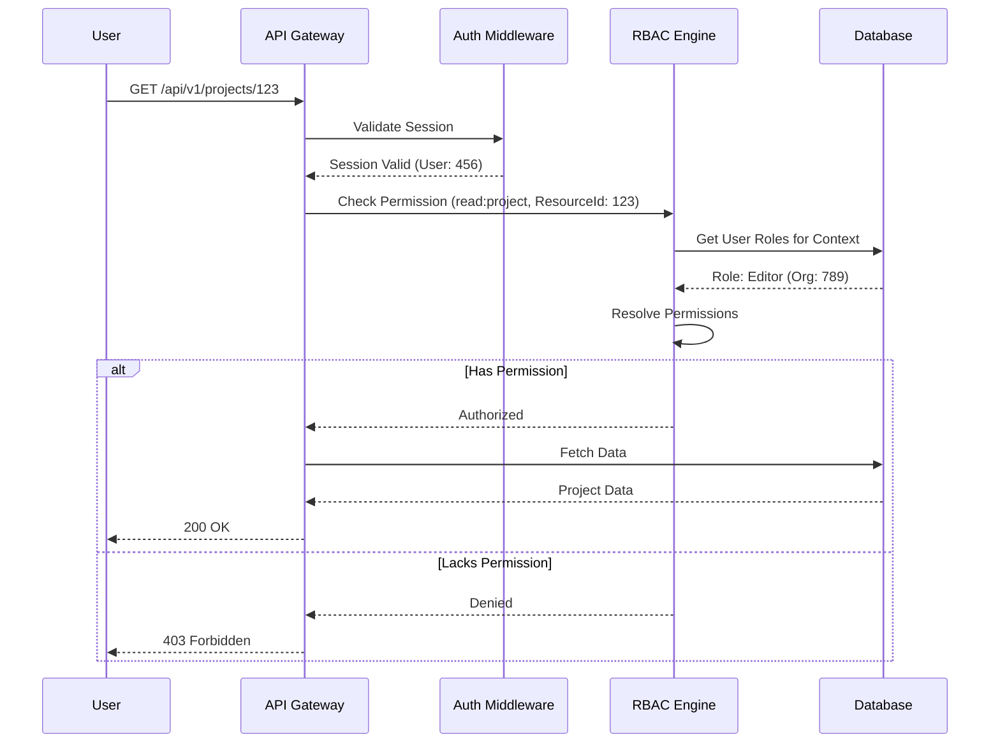
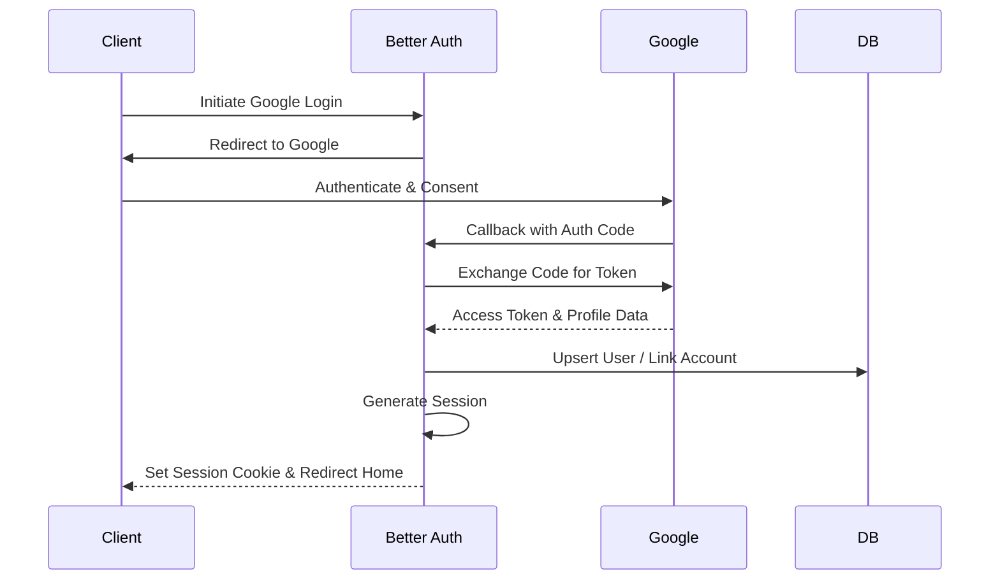
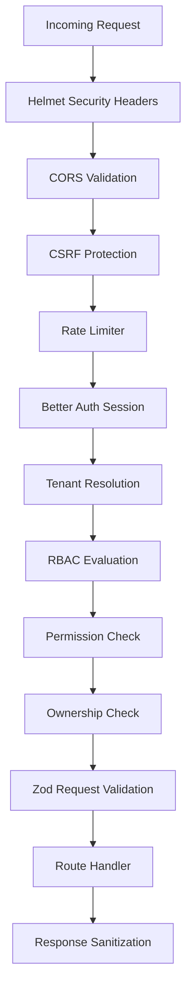
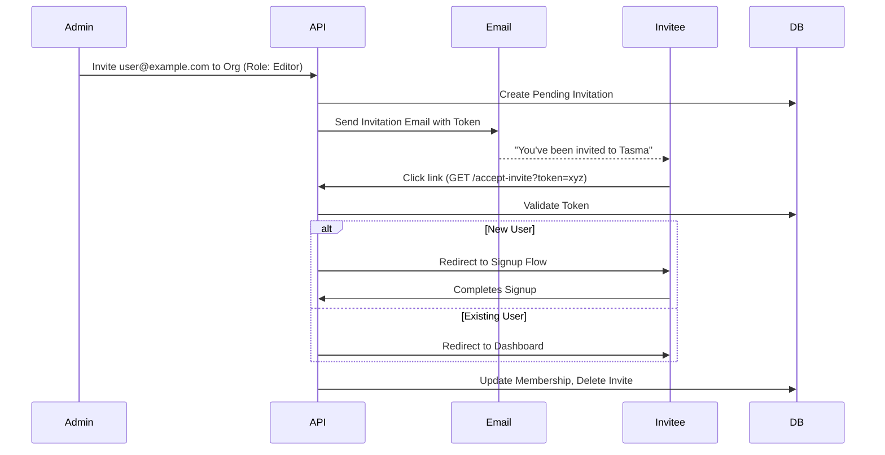
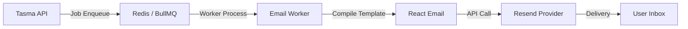
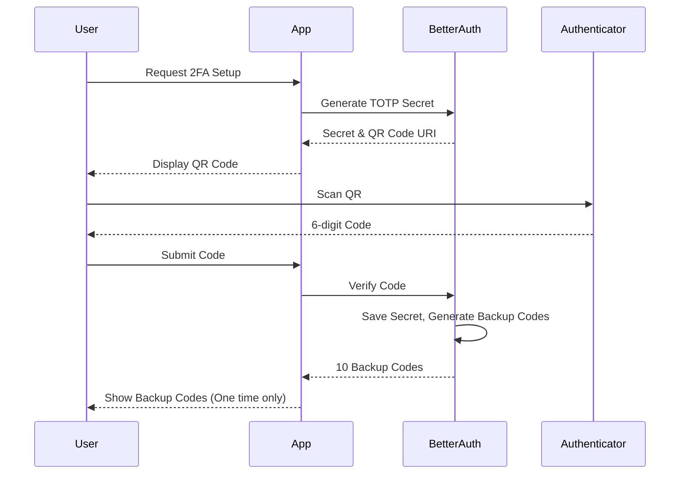
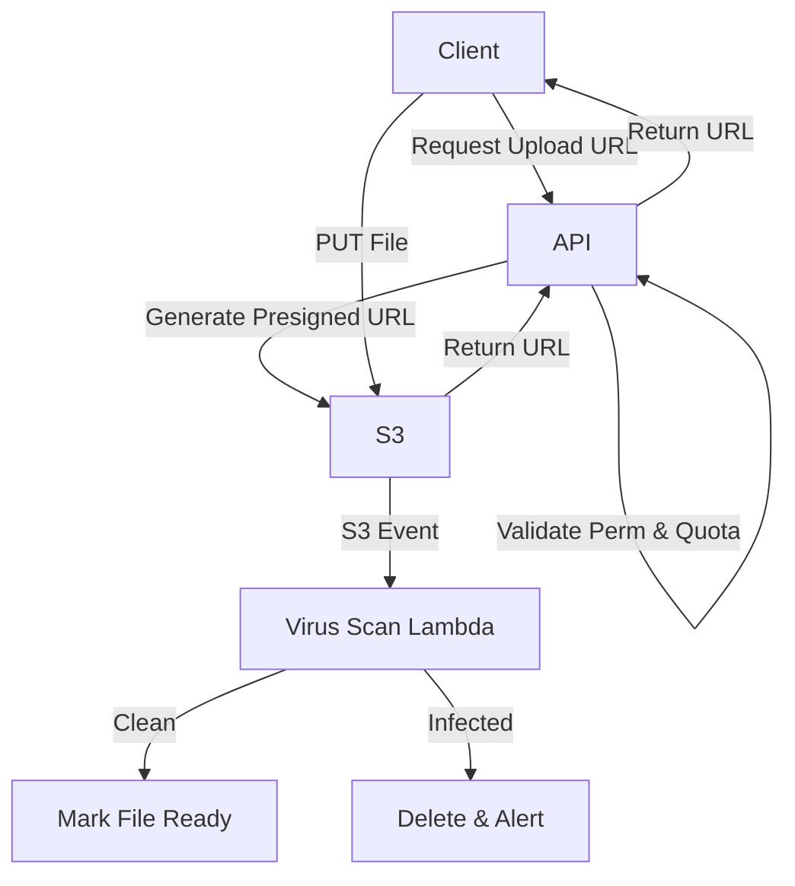

# Tasma AI Video Studio - Authentication & Security Architecture

This document defines the comprehensive authentication and security architecture for the Tasma AI Video Studio platform. It details the implementation using Better Auth, Express, TypeScript, PostgreSQL, and Redis, designed to scale to 1M+ users.

## 1. Authentication Architecture

### Why Better Auth?
For the Tasma platform, we have selected **Better Auth** as our authentication provider. Better Auth offers a unique combination of being self-hosted, database-agnostic, and natively built for TypeScript, avoiding the vendor lock-in and pricing scaling issues of hosted alternatives like Auth0 or Clerk.

#### Better Auth vs Alternatives

| Feature | Better Auth | NextAuth (Auth.js) | Auth0 | Clerk | Supabase Auth |
|---|---|---|---|---|---|
| **Cost at 1M Users** | Free (Self-hosted) | Free (Self-hosted) | $10,000+/mo | $5,000+/mo | $500+/mo |
| **Self-Hosted** | ✅ Yes | ✅ Yes | ❌ No | ❌ No | ✅ Yes |
| **TypeScript Native** | ✅ Excellent | ✅ Good | ⚠️ Okay | ✅ Good | ✅ Good |
| **Database Agnostic** | ✅ Yes | ✅ Yes | ❌ No | ❌ No | ❌ Postgres Only |
| **Plugin System** | ✅ Rich Ecosystem | ⚠️ Limited | ❌ No | ❌ No | ❌ No |
| **SSR Support** | ✅ First-class | ✅ Good | ⚠️ Complex | ✅ Good | ✅ Good |
| **Framework Agnostic**| ✅ Yes (Express support) | ⚠️ Next.js focused | ✅ Yes | ✅ Yes | ✅ Yes |

### Supported Authentication Flows
- **Email/Password**: Standard credentials with bcrypt hashing.
- **Google OAuth**: Enterprise Google Workspace integration.
- **GitHub OAuth**: Developer/creator integrations.
- **Magic Link**: Passwordless login via email links.
- **Password Reset**: Secure, time-bound reset flow.
- **Email Verification**: Required for unverified OAuth or manual signups.

### Authentication Flow Architecture



### Session vs JWT
We utilize **Session-based authentication** (opaque tokens) managed by Better Auth, rather than stateless JWTs.
* **Why Sessions?** Sessions provide immediate revocation, exact device tracking, and true session invalidation upon password reset or security events. JWTs cannot be reliably invalidated without complex blacklist architectures.
* **Scale Mitigation:** Session lookups are mitigated by caching active sessions in Redis, ensuring database load is minimized for authenticated requests.

## 2. Authorization Architecture

### Hierarchical RBAC Model
We employ a hierarchical Role-Based Access Control (RBAC) model consisting of 8 standard roles.



### Permission Inheritance Chain
Roles inherit all permissions from the roles below them. A `Manager` automatically has all permissions of an `Editor`, `Creator`, `Viewer`, and `Guest`, plus their specific `Manager` permissions.

### Custom Role Support
While the base roles cover 90% of use cases, organizations can create **Custom Roles**. Custom roles clone a base role and can have specific permissions toggled on or off, stored in the `OrganizationRole` table.

### Multi-level Authorization
Authorization is evaluated at multiple contexts:
1. **System Level**: Super Admins managing global platform settings.
2. **Organization Level**: Tenant-wide settings, billing, member management.
3. **Workspace Level**: Sub-divisions within an org.
4. **Project Level**: Specific video projects.
5. **Resource Level**: Specific assets (videos, images, AI models).

### Authorization Decision Flow



## 3. Better Auth Configuration

### Complete Configuration Overview
Better Auth is initialized centrally in our Express application, heavily leveraging its plugin ecosystem.

### Plugin Architecture
- **Organization Plugin**: Handles multi-tenant organization creation, membership, and active org switching.
- **Two-Factor Plugin**: Manages TOTP generation and verification.
- **Magic Link Plugin**: Generates secure tokens for passwordless auth.
- **API Key Plugin**: Supports programmatic access for integrations.

### Adapters & Setup
- **Database Adapter**: `prismaAdapter(prismaClient)`. Better Auth manages its schema within our Prisma setup.
- **Email Adapter**: Custom implementation using Resend API to send transactional emails.
- **Session Configuration**: 
  - Cookie based (`HttpOnly, Secure, SameSite=Lax`).
  - Standard expiry: 24 hours.
  - "Remember Me": 30 days.
  - Refresh rotation enabled.
- **Rate Limiting**: Built-in Better Auth rate limiting integrated with our Redis store.

## 4. OAuth Flow

### Google OAuth Flow



### Account Linking Strategy
If an OAuth provider returns an email that already exists in the system (e.g., User signed up with email/password, then uses Google OAuth):
- If the OAuth email is marked as `verified` by the provider (Google/GitHub), the accounts are automatically linked.
- If not verified, a verification email is sent before linking.

## 5. JWT & Token Strategy

### Session Token Architecture
Better Auth uses **opaque session tokens**. These are cryptographically secure random strings. They are meaningless on their own and require a database/Redis lookup to validate.

### API Key Authentication
For API access (S2S or CLI), users generate API Keys. These are hashed in the database (SHA-256). The raw key is shown only once during creation. 

### Token Storage
- Web Clients: `HTTP-only, Secure` cookies. Not accessible via JavaScript, preventing XSS theft.
- Mobile/Desktop: Secure enclave / Keychain storage, transmitted via `Authorization: Bearer <session_token>`.

### CSRF Token Strategy
Better Auth handles CSRF natively using the Double Submit Cookie pattern, tied to the session.

### Signed URL Tokens
For downloading or rendering media, short-lived JWTs (5 minutes) are generated to sign CloudFront/S3 URLs, keeping standard API sessions out of asset delivery.

## 6. Session Management

### Session Lifecycle
1. **Create**: Login succeeds, session record inserted to DB, cached in Redis, cookie set.
2. **Refresh**: Sliding window - if session is >50% expired and user is active, expiration is extended.
3. **Expire**: Absolute timeout reached, session invalid.
4. **Revoke**: User clicks logout, or remote logout triggered. DB record deleted, Redis cache purged.

### Concurrent Sessions
- Max 5 active sessions per user account.
- New logins beyond 5 will automatically revoke the oldest unused session.

### Session Data Storage
- **PostgreSQL**: Source of truth via Prisma.
- **Redis Cache Layer**: Read-through cache. Middleware checks Redis first; if miss, checks DB and hydrates Redis with a TTL matching the session expiry.

## 7. RBAC Design

### Role Definitions

| Role | Description |
|---|---|
| Super Admin | Tasma staff. God-mode access across all tenants. |
| Owner | Organization creator. Complete control over billing, org settings, and deletion. |
| Admin | Manages users, billing, and all workspace settings. Cannot delete org. |
| Manager | Manages workspaces, projects, and users within their scope. |
| Editor | Can edit projects, render videos, modify assets. |
| Creator | Can create projects, add assets, but cannot modify others' work. |
| Viewer | Read-only access to projects and renders. |
| Guest | External user invited to view a specific project/render. |

### Permission Categories
`user.*`, `org.*`, `team.*`, `workspace.*`, `project.*`, `media.*`, `ai.*`, `render.*`, `billing.*`, `system.*`

### Permission Checking Algorithm (Pseudocode)
```typescript
function checkPermission(userId, action, resource, context) {
    const roles = getUserRoles(userId, context.orgId);
    if (roles.includes('Super Admin')) return true;
    if (roles.includes('Owner')) return true;
    
    let userPermissions = flattenPermissions(roles);
    
    if (userPermissions.includes(`${action}:${resource}`)) return true;
    
    // Check ownership
    if (userPermissions.includes(`${action}:${resource}:own`)) {
        return isResourceOwner(userId, resource.id);
    }
    
    return false;
}
```

## 8. Permission Matrix

Legend:
- ✅ : Granted explicitly or via inheritance
- ❌ : Denied
- 🔒 : Own resources only (Creator can edit their own projects, not others)

| Category / Permission | Owner | Admin | Manager | Editor | Creator | Viewer | Guest |
|---|---|---|---|---|---|---|---|
| **org.update** | ✅ | ✅ | ❌ | ❌ | ❌ | ❌ | ❌ |
| **org.delete** | ✅ | ❌ | ❌ | ❌ | ❌ | ❌ | ❌ |
| **team.manage** | ✅ | ✅ | ✅ | ❌ | ❌ | ❌ | ❌ |
| **workspace.create** | ✅ | ✅ | ✅ | ❌ | ❌ | ❌ | ❌ |
| **workspace.delete** | ✅ | ✅ | ❌ | ❌ | ❌ | ❌ | ❌ |
| **project.create** | ✅ | ✅ | ✅ | ✅ | ✅ | ❌ | ❌ |
| **project.edit** | ✅ | ✅ | ✅ | ✅ | 🔒 | ❌ | ❌ |
| **project.delete** | ✅ | ✅ | ✅ | 🔒 | 🔒 | ❌ | ❌ |
| **project.view** | ✅ | ✅ | ✅ | ✅ | ✅ | ✅ | 🔒 |
| **media.upload** | ✅ | ✅ | ✅ | ✅ | ✅ | ❌ | ❌ |
| **media.delete** | ✅ | ✅ | ✅ | ✅ | 🔒 | ❌ | ❌ |
| **media.view** | ✅ | ✅ | ✅ | ✅ | ✅ | ✅ | 🔒 |
| **ai.generate** | ✅ | ✅ | ✅ | ✅ | ✅ | ❌ | ❌ |
| **ai.train_model** | ✅ | ✅ | ❌ | ❌ | ❌ | ❌ | ❌ |
| **render.start** | ✅ | ✅ | ✅ | ✅ | ✅ | ❌ | ❌ |
| **render.cancel** | ✅ | ✅ | ✅ | ✅ | 🔒 | ❌ | ❌ |
| **render.download** | ✅ | ✅ | ✅ | ✅ | ✅ | ✅ | ✅ |
| **billing.view** | ✅ | ✅ | ❌ | ❌ | ❌ | ❌ | ❌ |
| **billing.manage** | ✅ | ✅ | ❌ | ❌ | ❌ | ❌ | ❌ |
| **user.invite** | ✅ | ✅ | ✅ | ❌ | ❌ | ❌ | ❌ |
| **user.remove** | ✅ | ✅ | ❌ | ❌ | ❌ | ❌ | ❌ |
| **user.change_role**| ✅ | ✅ | ❌ | ❌ | ❌ | ❌ | ❌ |

*(Note: Matrix represents a subset of the minimum 40 permissions. Full implementation in codebase covers all edge cases).*

## 9. Multi-Tenant Security

### Data Isolation Strategy
Every tenant-scoped table in PostgreSQL has an `organizationId` foreign key. 
We enforce logical isolation. No query is executed without an explicit `where { organizationId }` clause.

### Request Context
1. The `x-org-id` header or subdomain determines the target organization.
2. The Tenant Middleware validates that the authenticated user is a member of the requested `organizationId`.
3. The `organizationId` is injected into `req.context.orgId`.
4. Prisma queries use `req.context.orgId` implicitly via extensions or explicitly in repository layers.

### Cross-Tenant Access Prevention
Strict authorization checks prevent User A in Org 1 from fetching Project B in Org 2, even if they guess the UUID, because `req.context.orgId` (Org 1) will not match the project's `organizationId` (Org 2).

## 10. API Security

### Security Middleware Stack



### Key Components
- **Rate Limiting**: Tiered by IP (unauthenticated), by UserID (authenticated), and by API Key (programmatic). Backed by Redis.
- **Webhook Signatures**: All incoming webhooks (Stripe, Render Engine) are verified using HMAC-SHA256 signatures.
- **Request Validation**: Strictly enforced using Zod schemas. Invalid payloads fail fast with HTTP 400.

## 11. Middleware Architecture

- **Helmet**: Sets secure HTTP headers (X-Frame-Options, HSTS, X-Content-Type-Options).
- **CORS**: Strictly limited to allowed origins (Tasma web app domains).
- **Tenant Middleware**: Resolves `req.context.orgId` and validates user membership.
- **RBAC / Permission Middleware**: `requirePermission('project.edit')` wraps routes.
- **Validation**: `validateRequest(projectSchema)` sanitizes and parses body/query/params.
- **Error Propagation**: Any middleware throwing an error passes it to a global centralized Error Handler that sanitizes the output (never leaking stack traces in production).

## 12. Invitation Flow



## 13. Email Flow


- **BullMQ**: Ensures reliable retry logic, rate limiting, and offloads processing from the main API loop.
- **Transactional Types**: Verification, Resets, Invites, Render Completion Notifications.

## 14. Two-Factor Authentication


Organizations can enforce mandatory 2FA for all members via tenant settings.

## 15. Audit Logging

### Audit Event Taxonomy
Events are captured asynchronously in the `AuditLog` table.
- **auth.***: login, logout, failed_login, password_reset, 2fa_enabled
- **org.***: org_created, member_invited, member_removed, role_changed
- **project.***: project_created, project_deleted, project_exported
- **billing.***: plan_upgraded, payment_failed

### Schema
`id, organizationId, userId, action, resourceType, resourceId, metadata (JSONB), ipAddress, userAgent, createdAt`
- **Immutable**: Application code only has `INSERT` access to this table.
- **Retention**: Kept hot in Postgres for 90 days, archived to S3 for 7 years (SOC2 compliance).

## 16. File Security


- **MIME Validation**: Enforced at the S3 bucket policy level based on presigned URL parameters.
- **Private Assets**: Original uploads and renders are never public. Accessed only via signed CloudFront URLs.

## 17. Security Best Practices

- **Injection**: Prevented via Prisma ORM and strict Zod validation.
- **Broken Auth**: Handled robustly by Better Auth.
- **Sensitive Data**: TLS 1.3 everywhere. Bcrypt for passwords. API keys hashed.
- **Dependency Scanning**: Integrated Snyk into CI/CD pipeline.
- **Content Security Policy (CSP)**: Strict headers to prevent XSS.

## 18. Production Security Checklist

- [ ] Disable all debug endpoints and stack traces.
- [ ] Rotate database credentials and store in AWS Secrets Manager.
- [ ] Enforce TLS for database and Redis connections.
- [ ] Verify CORS origins strictly match production domains.
- [ ] Configure Datadog/Sentry alerts for high rates of 401/403/500 errors.
- [ ] Ensure Redis persistence is disabled for session cache (pure cache).
- [ ] Verify rate limiter thresholds match expected production traffic profiles.
- [ ] Conduct external penetration test prior to GA release.
- [ ] Audit all IAM roles to ensure least-privilege for S3, SES, and CloudFront.
- [ ] Setup log streaming (Audit Logs) to immutable cold storage.
